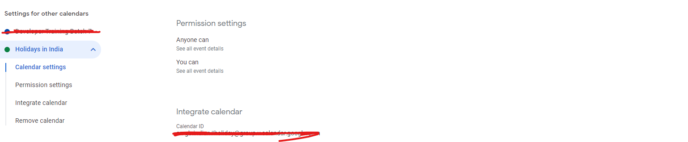

# aspnet-core-google-calendar-integration-with-scheduler

This sample explains about how to integrated Google Calendar events in Syncfusion ASP.NET Core Scheduler with exsisting events.

## Prerequisites

* Visual Studio 2022
* Google calendar API key - You can generate the API key by following the steps mentioned in this [link](https://support.google.com/googleapi/answer/6158862?hl=en).
* Google calendar ID - You can find the ID of your calendar in the settings, as shown in the following image.

## How to run the project

* Checkout this project to a location in your disk.
* Open the solution file using the Visual Studio 2022.
* Restore the NuGet packages by rebuilding the solution.
* Add the Api key and calendar id into the HomeController.cs files.
* Run the project.
